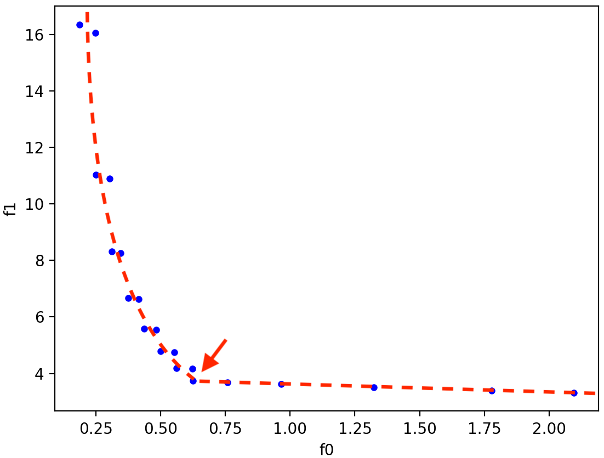
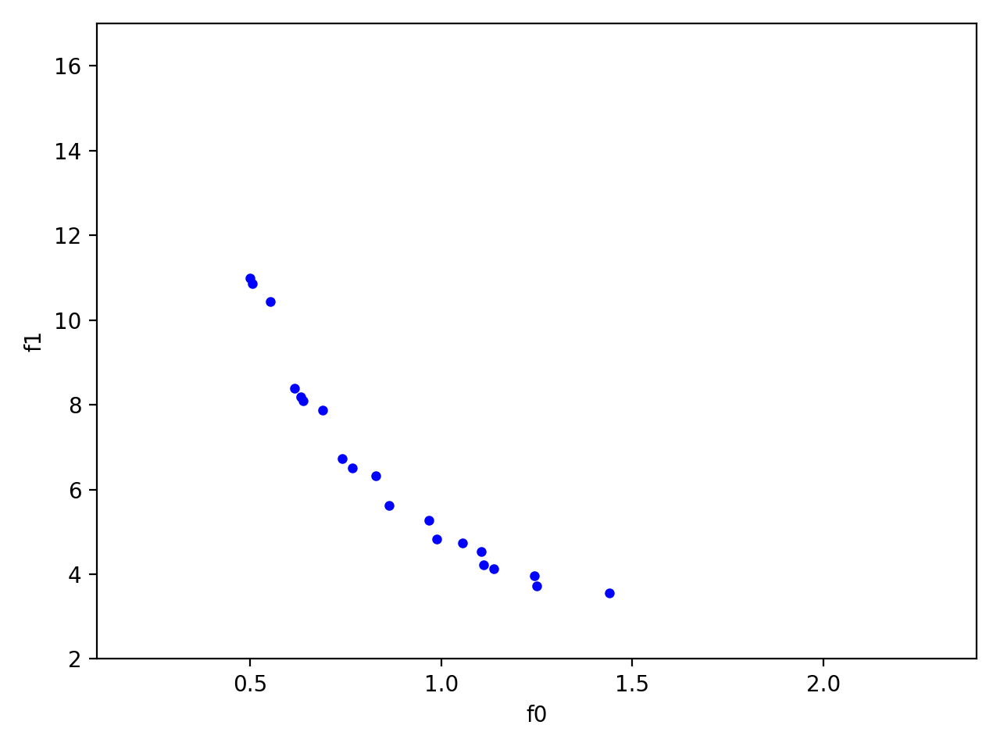
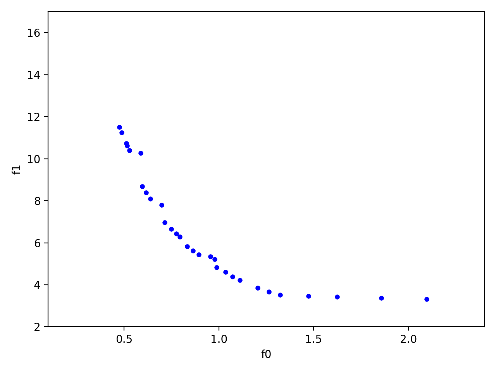
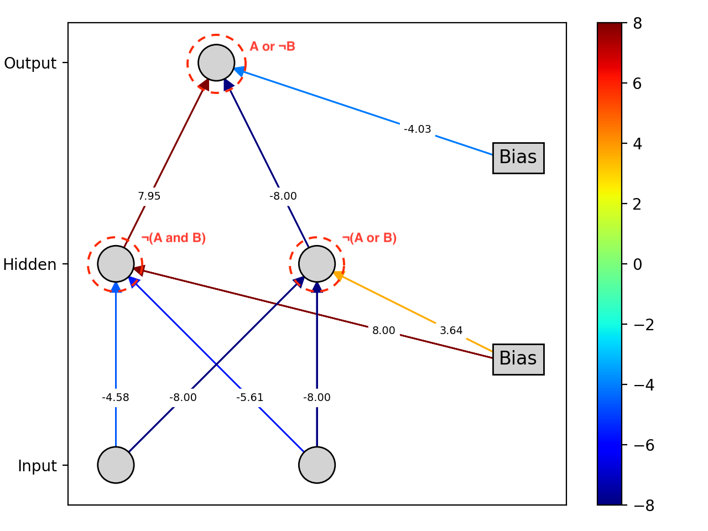
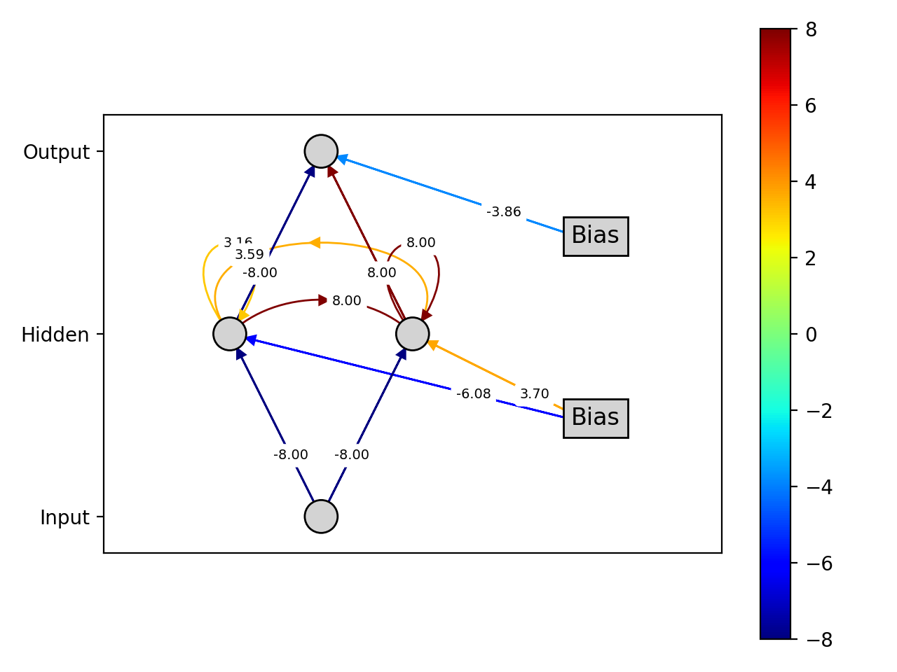
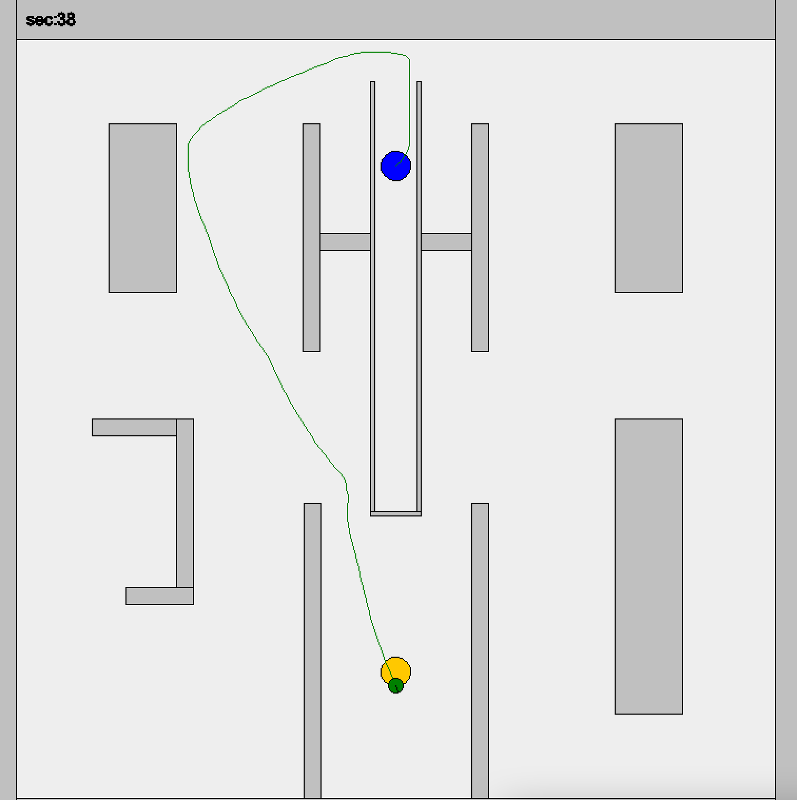
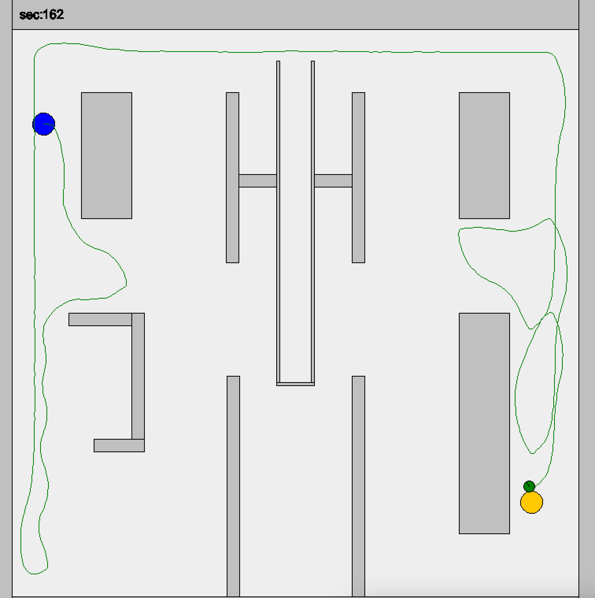

# Bio-Inspired Artificial Intelligence - Lab. Notes  

**Note:** All the experiments have been run with `seed=42`.


## Table of Contents

1. [Introduction](#lab-01---Introduction)
2. [Evolutionary Algorithms I](#lab-02---evolutionary-algorithms-i)
2. [Evolutionary Algorithms II](#lab-03---evolutionary-algorithms-ii)
4. [Multi-Objective Problems](#lab-04---multi-objective-problems)
5. [Constrained Problems](#lab-05---constrained-problems)
6. [Swarm Intelligence I](#lab-06---swarm-intelligence-i)
7. [Swarm Intelligence II](#lab-07---swarm-intelligence-ii)
8. [Neuro-evolution](#lab-08---neuro-evolution)
9. [Swarm and Evolutionary Robotics](#lab-09---swarm-and-evolutionary-robotics)
10. [Competitive Co-Evolution](#lab-10---competitive-co-evolution)
11. [Genetic Programming](#lab-11---genetic-programming)


## Lab. 01 - Introduction

### Exercise 1
- **Do the mutations tend to improve or worsen the fitness of the parent?** \
In general the mutations do not produce any particular worsening or improvement in the fitness of the parent: since they are random mutations, they can either go toward or away from the minimum. 

- **Are low or high mutation magnitudes best for improving the fitness? How does this depend on the initial value of the parent and on the number of dimensions of the search space?** \
In this case, higher mutations magnitudes have a better change of producing a better offspring. Since we are running the mutation on just one iteration, the magnitude represent the maximum "range of motion" from the parent when searching a new solution. However, if the order of magnitude is too high, the new solutions will be more scattered and the change of having an optimum solution will be lower. Therefore, the magnitude should be proportional to the initial parent distance form the optimum.

### Exercise 2
- **Compare different values for the number of dimensions of the search space.** \
In general, an higher number of dimensions corresponds to an overall higher fitness (worse), since the number of feature with potential error is larger and we are not normalizing the fitness over the number of dimensions.

- **Compare different values for the value of the parent (how close it is to the optimum).** \
With lower initial parent values, the offspring solutions have more change of being near the optimum, and therefore the overall fitness is lower (better).

- **Compare different values for the mutation magnitude σ.** \
With higher magnitude values, the maximum deviation obtainable from the initial parent solution is higher. Therefore, if the initial distance of the parent from the optimum is large, the offspring have better change of be near the optimum (zero). Otherwise, if the initial parent values are near the optimum, there is an higher chance of "overshooting" the minimum and skipping it, producing a more scattered offspring with more solutions that are distant from the zero, while the solutions obtained with a lower mutation magnitude would have been less scattered and better overall.

### Exercise 3
- **How close is the best individual from the global optimum?** \
In 1-D, the best individual is at 0.0013, very near to the optimum (zero).

- **Increase the dimensionality, how close are the best individuals now from the global optimum?** \
In 2-D, the best individual has a fitness of 0.0258. In 10-D, the best individual has a fitness of 1.8309.

- **Can you get as close as in the one-dimensional case by modifying the mutation magnitude and/or the number of generations?** \
By changing the mutation magnitude to 0.1 and the number of generations to 500, the EA is able to reach a fitness of 0.0002 for 2-D and 0.1362 for 10-D.

### Exercise 4
- **Did you see any difference in the best fitness obtained?** \
After some tests, we can summarize the results as obtained based on the parameters values. With:
    - *Low σ (~0.01), low #gen (~50)*: poor results, probably caused by slow convergence.
    - *Low σ (~0.01), high #gen (~500)*: good results, small steps but many generations.
    - *High σ (~1), low #gen (~50)*: poor results, mutation magnitude too high, "overshoots" the optimum value.
    - *High σ (~1), high #gen (~500)*: poor results, like before "overshoots" the optimum value. An higher number of generations do not produce any sensible improvements.

    Therefore we can say that:
    - The *mutation magnitude σ* drives the convergence speed. An higher value needs less generations to approach the minima, but if it's too high there is a risk of doing single steps that are too large and go beyond the optimum point.
    - The *number of generations* drives the final result distance. More generations can produce a better result, but the algorithm is more computationally expensive.

### Questions
- **What is the genotype and what is the phenotype in the problems considered in this lab?** \
The *genotype* is the vector representations of the solution. The *phenotype* is the solution itself, with specific real values on the vector representation.

- **What are the advantages and disadvantages of low/high mutation magnitudes in EAs?** \
An higher mutation magnitudes value needs less generations to approach the minima, but if it's too high there is a risk of doing single steps that are too large and go beyond the optimum point. On the other hand, a low magnitude values may produce more accurate results, bu the convergence will be slower.

- **Based on the previous observations, do you think there is an optimal mutation magnitude for a biological organism? Do mutations typically improve or worsen the fitness of a biological organism? In which situations do you think low/high mutation rates are advantageous for a population of bacteria?** \
I think that in the particular case of biological organisms the mutations usually have no noticeable effect on the fitness of the organism. In the case of a bacteria population, a higher mutation rate may be advantageous in extreme environments, where the living conditions can change rapidly and an high adaptability can be determinant for survival.


## Lab. 02 - Evolutionary Algorithms I

### Exercise 1
- **Do you see any difference between the two results (crossover-only and mutation-only)? Why?** \
The mutation-only EA obtained a better score than the crossover-only EA. This is probably because with mutations we are introducing new information in the genes, while with crossover this is not possible. Therefore when using crossover-only, a "bad" initialization can lead to no improvements and thus a "bad" offspring. Moreover, the mutation-only EA obtained a better distribution of individuals in the search space. 

### Exercise 2
- **Is there an optimal crossover fraction for this fitness function? Why?** \
After some tests, we can observe that in general, with a crossover rate of:
    - *0%* we obtain a large variability in the results, but the fitness is overall higher (worse) than the other crossover rates, the same for the best individual's fitness. This correspond to a mutation-only EA.
    - *25%-50%-75%* we obtain very little changes in the results, considering both the average and best fitnesses. This can variate from execution to execution.
    - *100%* we obtain the best results, with the best fitness. The average is fitness of the final population is also lower.

### Exercise 3
- **Which tournament size gives better results for the fitness function Sphere and why?** \
A tournament size of 10 gave better results (0.02) than a size of 2 (0.27). This is probably because the pressure selection is higher, since if used a group size of 2, we would have 25/2=~12 groups, and therefore 12 best individuals would be selected. Instead, with a tournament size of 10, we have 25/10=~2 groups, and 2 best individuals are selected. Therefore, the convergence is faster since we have only 1 global optima and we consider at each generation only the best 2 individuals.

- **Which tournament size gives better results for the fitness function Rastrigin and why?** \
A tournament size of 2 gave better results (52,11) than a size of 2 (78.59). This is probably because the pressure selection is lower, and since we don't have just one global minimum (as the Sphere function) but many local minimum, a lower selection pressure gives a better coverage of the fitness landscape. Therefore, by using a lower tournament size we are avoiding to concentrate on few local minimums and we are instead exploring more the landscape.

### Exercise 4
- **Do you see a different algorithmic behavior when you test the EA on different benchmark functions? Why?** \
In general, the same parameter values can obtain very different results on different problems.

- **What is the effect of changing the number of variables on each tested function?** \
An higher number of variables drastically decrease the performance of the EA, in every tested function. This is caused by the "curse of dimensionality" since more variables mean a larger space to explore.

### Questions
- **Why is it useful to introduce crossover in EA? Can you think of any cases when mutation-only can work effectively, without crossover? What about using crossover only, without mutation?** \
Crossover can be useful to exploit the synergy between good solutions, with the hope of obtaining a better solution. Mutation-only can work effectively for example when the fitness landscape has just one global optimum. However it is prone to lose the information acquired in good solutions. Crossover-only is usually not that useful, since it does not introduce any new information in the solution.

- **What’s the effect of changing the fraction of offspring created by crossover?** \
By changing the fraction of offspring created by crossover, we generally increase the convergence speed.

- **Are there optimal parameters for an EA?** \
No, at least not "global optimal parameters" that works well for every problem, since the performance obtained by a set of parameters strictly depend on the type of the problem, in particular on the fitness function we want to optimize.

- **What are the advantages and disadvantages of low/high selection pressure?** \
An high selection pressure can obtain a faster convergence, since we exploit only the best individuals. However, it can also reduce the variability of the population, thus the algorithm may get stuck in a local minima instead of exploring more the search space (*premature convergence*).


## Lab. 03 - Evolutionary Algorithms II

### Exercise 1
- **What happens if you make λ smaller e.g. λ = μ?** \
By decreasing λ (and maintaining the number of evaluations constant by increasing the "max_generations" param accordingly) we obtain a faster convergence speed, while the results in the long run remain quite stable across the different values of λ.

- **What happens if you increase the mixing number ρ?** \
By increasing the mixing number ρ, the overall fitness is better (lower) and the convergence speed is much faster. This is probably because we are using more parents, increasing the variability of the generated offspring.

- **Try out the different strategy modes and observe how they affect the performance of the algorithm** \
The results changes based on the value of ρ. With a ρ=1, between None (no self-adaptation), Global and Individual strategies, Global gives the better results by a factor of 50 w.r.t. the Individual strategy. However, if we increase the value of ρ s.t. ρ>1, e.g. ρ=5, the Individual strategy obtain the best performances overall, by a factor of 10 w.r.t. the Global, while the performance of the None strategy are far behind (fitness = ~143 against ~0.02 of Individual). 

### Exercise 2
- **How does the self-adaptation strategy influence performance on this problem?** \
As mentioned before, None, Global and Individual obtain increasingly better results (in this order) with a ρ>1.

- **Does what you see here confirm what you suspected from the previous exercise?** \
Yes, as mentioned above.

- **How do the values of μ, ρ, and λ influence the performance given a particular self-adaptation strategy and other parameters?** \
With ρ=1, the Global self-adaptation strategy gives the best results, while with ρ>1 the Individual strategy seems to be the best choice.
Regarding the values of λ, with a lower value (e.g. 20) gives better results using the Global strategy, while a higher value (e.g 200) gives better results when using the Individual strategy.

- **Can you come up with any rules of thumb for choosing these parameters?** \
In general, with ρ=1, it may be better to use a Global self-adaptation strategy. In the other cases, with ρ>1, the Individual strategy seems to give the best results. The performance of the None strategy are in every case worse, so it may preferable to not use it.

- **Can you find a choice of parameters that work properly across several problems?** \
After some testing, the parameters that gives the best results across different problems are:
    - μ = 20
    - λ = 120
    - ρ = 10
    - self-adaptation strategy = Individual

### Exercise 3
- **Can CMA-ES find optima to different problems with fewer function evaluations?** \
TODO

- **How do these differences change with different pop. sizes and problem dimensions?** \
TODO

### Questions
- **Do the observations you made while varying μ, ρ, and λ confirm or contradict the conclusions you drew last week?** \
TODO

- **What are the advantages of self-adaptation in evolutionary computation?** \
TODO

- **In what ways might self-adaptation be occurring in biological organisms?** \
TODO

- **Compare the different self-adaptation strategies explored in this exercise. In what ways are certain strategies better than others for optimization? In what ways are certain strategies more biologically plausible than others?** \
TODO

- **Describe what reasons may contribute to better performance of CMA-ES and what can be the conditions when CMA-ES is not better than a basic ES.** \
TODO


## Lab. 04 - Multi-Objective Problems

### Exercise 1 (Scalarization)
- **What happens when you run the GA with this fitness function (Kursawe)?** \
The GA try to find a solution that go towards the minimum on both objectives. In particular, with both weights set to 0.5, we can clearly see that the GA algorithm find solution that are very close to one of the local minimums of the second objective, in particular to the local minimum that is closer to the global minimum of the first objective.

- **Why do you obtain this result?** \
This is because both objectives are given the same importance. However, since the fitness values of the second objective are much larger outside the local minimum, the GA try to first find solutions that are in that minimum. Therefore the final population displacement resemble a cross, similar to the landscape of the second objective function. Between all the local minimum however, the GA select the one nearer to the global minimum of the second objective.

- **What happens if you give the first (or second) objective all of the weight?** \
By giving all the weights to the first objective, the GA find a best solution only for that objective, therefore we obtain a population centered on its global minimum. The same result is obtained if we assign all the weights to the second objective, with the GA minimizing only that function.

- **Can you find a weighting able to find a solution that approaches the optimum on both objectives?** \
By setting the weights to `[0.7, 0.3]` we find a good compromise between the fitness on the two objectives, i.e. we obtain a fitness of -6.79 for the first and -6.82 for the second.

- **Does your weighting still work on the new problem (DTLZ7)?** \
If we use DTLZ7 with `num_obj = 2` and weights `[0.7, 0.3]` we obtain a fitness of 0 for the first objective and 4.0 for the second objective. However, if we change the weights to `[0.55, 0.45]`, we obtain finesses of 0.85 and 2.86 respectively, a solution that may preferable based on the context.

- **Can you think of a method for combining the objectives that might work better than using a weighted sum?** \
In the case of DTLZ7, if we want to obtain a better fitness on the second objective, we may want to compute the total fitness as a non-linear combination of the fitnesses, e.g. f = f1^0.5 + f2^2

### Exercise 2 (NSGA-2)
- **How do the solutions you find here compare to those found in Exercise 1?** \
In the case of Kursawe, the results found in the previous exercise, in particular with weights `[0.7, 0.3]`, could still be considered "acceptable" since they will still belong to the Pareto front.

- **Is there a single solution that is clearly the best?** \
No, since the final Pareto front includes all the solutions that are incomparable with each others, i.e. they are all non-dominated. For this reason, there is no single best solution that is clearly best than the others

- **Can you still find good solutions (with DTLZ7)?** \
Yes, the found solutions are still good compared to the ones found in Exercise 1 (still considering num_obj=2 and num_vars=21), i.e. the solution found before could still be part of the Pareto front.

- **What happens if you increase the population size or the number of generations?** \
By increasing the population size (e.g. from 50 to 200), we obtain more solutions on the Pareto front, but the total coverage of the Pareto front remains the same, with more crowded areas. \
By increasing the number of generations (e.g. from 100 to 400), we obtain a better approximation of the real Pareto front, i.e. the solutions are more aligned with the real expected Pareto front. Therefore we obtain better non-dominated solutions.

### Exercise 3
- **Is the algorithm able to find reasonable solutions to this problem?** \
Yes, for example a solution (found with pop_size=10 and max_gen=10) with a weight of 1.17Kg and a brake time of 4.16 seconds seems a reasonable solution for a real brake system. If we increase the pop_size (e.g. to 100), we obtain more solutions to choose from in the Pareto front, but the results are not very different from the previous ones. If we instead increase the maximum number of generations (e.g. to 100), we obtain clearly better solutions, for example 0.62kg and 3.73 seconds.

- **Do you see any patterns in the Pareto-optimal solutions that may help you in designing a well-performing disk-brake in the future?** \
The obtained Pareto front has a clear descending pattern, with an elbow at ~0.62kg that can be identified as shown in the image below. Before the elbow, the stopping time (f1) decrease rapidly with a minimum increase in the total weight (f0). An optimal approach may be to select the nearest solution to this elbow, since after that value the weight increase rapidly without any noteworthy improvement on the stopping time.

<p align="center">
    
</p>

### Questions
- **When do you think it is appropriate to use a multi-objective evolutionary algorithm vs. combining multiple objectives into a single fitness function?** \
When there is a clear relation between the objectives that we want to optimize, it is probably better to exploit this relation and combine the objectives into a single fitness function. In the other cases, or if we want to have a better idea of the kind of optimization problem and possible solutions we are dealing with, it may be better to stick with a multi-objective EA.

- **What can the results of a multi-objective algorithm teach us about exploring the design spaces of engineering problems?** \
It can be useful to understand what kind of trade-off between the objectives we have to deal with in our problem, in order to also have a realistic idea of what are the maximum performance we can achieve in the ideal case.

- **In biological evolution it is possible to think of many phenotypic traits that contribute to the ultimate fitness of an organism (try to enumerate some of these). What (if any) relevance do multi-objective evolutionary algorithms have to biology?** \
Some example of biological phenotypic traits that have an impact on the fitness of an organism include height, wing length, eyesight, and any other characteristic that ultimately give an advantage over the other organisms. In biology, evolution is probably driven by different objectives that can compete with each other, like in a multi-objective EA. For instance, having larger wings may increase the overall stamina and speed of a bird, at the expense of being more easily identifiable by a prey.


## Lab. 05 - Constrained Problems

### Exercise 1
- **How do your results change from the unconstrained version (from the previous lab)?** \
With respect to the unconstrained solution, the range of the results is much narrower (see image below). In particular, the maximum stopping time (f1) is shorter from (~16 to ~11), and the maximum weight (f0) is lower (from ~2.2 to ~1.5). Moreover, the tradeoff between the two  metrics is less "steep", i.e. it's more difficult to identify an elbow in the trade-off between weight and stopping time w.r.t. the unconstrained version, and therefore it's more difficult to identify the "best" solutions with the best trade-off in the Pareto front.

<p align="center">
    
</p>

- **Do your previous parameters continue to solve the problem?** \
Yes, the parameters used for the unconstrained version (pop_size=20, max_gen=100) obtain better results than the default ones (pop_size=10, max_gen=10).

- **Try to increase the population size and/or the number of generations to see if you can find better solutions.** \
By increasing the parameters values to pop_size=30 and max_gen=500 we obtain a larger choice of good solutions and the Pareto front become more visible. However, the solutions are not particularly better in terms of dominance with the previous ones. 

<p align="center">
    
</p>

### Exercise 2
- **Do you see any difference in the GA’s behavior (and results) when the penalty is enabled or disabled?** \
When using the RosenbrockDisk problem class with penalties, the best fitness value obtain is usually an order of magnitude lower than the best fitness obtained by the version without penalties. However, the version without penalties is unable to find feasible solutions, as opposed to the penalized version. Moreover the solutions are less sparse w.r.t the version with penalties.

- **Try to modify the penalty functions used in the code of each benchmark function, and/or change the main parameters of the GA. Are you able to find the optimum on all the benchmark functions you tested?** \
With RosenbrockDisk, by setting penalty function to `g(x, y) = x^2 + y^2 - 20` (instead of -2), we obtain a best fitness close to the unconstrained version, with a value (0.0004) an order of magnitude smaller than the one with the original penalty function (0.006). The best results are obtained by also changing the gaussian_stdev to 0.1 and the mutation_rate to 0.8, with a final best fitness of 0.0001.

- **Is the GA able to find the optimal solution lying on the unit circle (with the SphereCircle benchmark)?** \
With the default values, no: the optimal solution (with a fitness of 2.02) lies outside the unit circle. The solution closest to the unit circle is obtained with pop_size=50 and gaussian_stdev=0.2, with a total penalty of 0.23. However, this solution is still unfeasible. By increasing the max_gen param to 400, we are able to obtain a solution very close to the unit circle, with a fitness of 1.03.

- **By default, the sphere function is defined in a domain [−5.12, 5.12] along each dimension. Try to increase the search space to progressively increasing boundaries. Is the GA still able to explore the feasible region and find the optimum?** \
Yes, even by increasing the search space to [-10, 10] or [-20, 20], the results are exactly the same as the ones obtained with a domain of [−5.12, 5.12].

- **If not, try to think of a way to guide the GA towards the feasible region. How could you change the penalty function to do so?** \
I don't think it is possible to change the penalty function, since it is the penalty function that defines the constraint of having a solution in the unit circle.

- **Try to modify the sphere function problem by adding one or more linear/non-linear constraints, and analyze how the optimum changes depending on the presence of constraints.** \
By adding a constraint like `x < 1` (that becomes `0 < 1 - x`) and `y < 1`, we are able to obtain solutions that resides very close to the unit circle, i.e. with a fitness of 1.0008 (better then the previous fitness of 1.03). In this case, we use three constraints in total:
```python
f = x**2 + y**2
# Constraints
g1 = x**2 + y**2 - 1
g2 = 1 - x
g3 = 1 - y
# Penalties
if g1 > 0: f = -1
if g2 > 0: f = f - g2
if g3 > 0: f = f - g3
```

### Questions
- **What do you think is the most efficient way to handle constraints in EAs?** \
If we consider computational efficiency, the most efficient way of handling constraints in EAs is probably by penalty, since it does not require additional expensive computations than an unconstrained EA and it is easy to implement. We can also use all the existing EA algorithm by simply changing the fitness function.

- **Do you think that the presence of constraints makes the search always more difficult? Can you think of cases in which the constraints could actually make the search easier?** \
in general es, they make the search more difficult because they introduce additional factors that add complexity the objective's fitness landscape, therefore potentially reducing the convergency speed. However, if we have a clear idea of the kind of solution we want to obtain, we can exploit the constraints to direct the search process towards the wanted feasible space. In this case the constraints would be only a way to limit the search space, since they would increase/decrease the fitness according to previous knowledge we have about the problem. They would not be something that we need to trade-off with the actual fitness and that slow down the search space.


## Lab. 06 - Swarm Intelligence I

### Exercise 1
- **What is the effect of each behavior coefficient?** \
    - *Cohesion:* the magnitude of the movement component towards the center of mass of the swarm. A lower value of its coefficient translates into a more compact swarm, since the resulting vector to reach the center of mass is divided by this coefficient.
    - *Alignment:* how much each boid will align according to its neighbors' alignments. Again, a larger value of its coefficient means a more chaotic swarm, since each boid will consider less important the current direction of its neighbors.
    - *Separation:* the minimum distance each boid has to maintain w.r.t. its neighbors. A lower value means a more compact swarm.

- **Which combination of coefficients leads to the most “natural” flock behavior?** \
In general, the best natural behavior is obtained with a large cohesion and small alignment and separation values. A small cohesion would make the boids go towards the center with too much velocity, creating a very fast and noisy swarm. Lower values for the alignment and separation keep the boids in the boids in an homogeneous direction and in a compact formation.

### Exercise 2
- **What kind of behavior does PSO have on different benchmark functions, in comparison with the EAs? Does it show better or worse results? Does it converge faster or not?** \
In case of the sphere function, the best results are obtained by ES, which also converge faster then GA and PSO. \
In case of the Rosenbrock function instead, PSO converges faster, but the best results are still obtained by ES. \
In case of multimodal functions, Rastrigin in particular, we still have that ES obtains better results and convergence speed. \
With the Griewank function instead, PSO obtain the best solution and converge sooner than ES and GA.

- **Increase the problem dimensionality to 10 or more. What do you observe in this case?** \
With the Sphere function and a dimensionality of 10, ES obtains again the best results. However, PSO converges faster than ES, while with a dimensionality of 2 ES was faster. If we keep increasing the dimensionality, to 20 or 50, GA starts to obtain better results than PSO and ES, with faster convergence and far better fitnesses, while PSO obtain the worst performance. \
The same results are obtained also with multimodal functions: after a certain number of dimensions, GA obtains the best results w.r.t. ES and PSO.

- **Change the population size and the number of generations, such that their product is fixed (e.g. 50 × 100, 100 × 100, etc.). Try two or three different combinations and observe the behavior of the three different algorithms. What do you observe in this case? Is it better to have smaller/larger populations or a smaller/larger number of generations? Why?** \
With unimodal functions, in general it seems to be better to have a small population with a large number of generations. By trying different combinations (i.e. (pop=10, gen=500 (pop=50, gen=100), (100, 50), (500, 10)), we can observe that the best results are obtained, with all three approaches (GA, ES, PSO), with pop_size=10 and max_generations=500. This is probably because we have just one global minimum, so it is not very important to have a greater variability in the population since it cannot end up stuck in a local minimum. Therefore with a larger number of generations the algorithms have more time to improve the results. \
The same results are not obtained with multimodal functions, where the best fitnesses are achieved with pop_size=50 and max_generations=100, for the same reason explained before. 

### Questions
- **When do you think it is useful to have a lower (higher) cognitive learning rate? What about the social learning rate?** \
An higher cognitive learning rate may be better when dealing with multimodal functions, since it favor exploration by giving more importance to the previous best values obtained by the individual. \
An higher social learning rate instead may be better with unimodal functions, since each individual will move more towards the current best neighbor, which is probably nearer the actual optima.

- **From a biological point of view, which neighborhood topology do you consider as the most plausible?** \
The distance-based topology seems to be most plausible if we consider the actual behavior of a swarm, since each individual can only see the neighbors in his field of view.


## Lab. 07 - Swarm Intelligence II

### Exercise 1 (TSP)
- **Which algorithm provides the best solution in most cases? What can you say about the number of function evaluations needed to converge?** \
In all the three instances of the problem, the best solution was always obtained by the Ant Colony System (ACS), which also converged must faster than the Evolutionary Algorithm (EA). ACS usually reaches the best solution in a matter of ~100 evaluations, and then the fitnesses oscillates without any significant improvement. EA instead shows a different behavior, with a more steady convergence that slows down at nearly ~1000 evaluations. Therefore ACS is the best choice, since it provides (on average) better results in less computational time.

### Exercise 2 (0/1 Knapsack)
- **Which algorithm provides the best solution in most cases? What can you say about the number of function evaluations needed to converge?** \
For most of the problem instances, EA and ACS obtained the more or less the same results, without any particular difference in the convergence speed (if we consider only the best solution found in  each evaluation). However, for the last problem instance, were we have a much larger capacity, ACS were able to find a significant better solution than EA (13.5M vs 13.2M). This could also be caused by the slower convergence speed of the EA algorithm, and therefore ACS may be the best choice when dealing with large-scale problems. 

### Exercise 3 (Knapsack with duplicates)
- **Which algorithm provides the best solution in most cases? What can you say about the number of function evaluations needed to converge?** \
With this problem ACS obtains again better results. Similar to exercise 1, also in this case ACS has a faster convergence speed: for example, in problem instance 05, ACS converges to the best solution (fitness 1410) almost immediately (~10 evaluations), while EA requires ~200 evaluations to converge to a fitness of only 906. The same behavior can be observed in most of the problem instances.

- **Do you observe any difference on the algorithmic behavior between this exercise and the previous one?** \
Yes, in particular the performance of ACS and EA were quite similar in the case 0f 0/1 Knapsack, if we do not consider the large case, while in the case of Knapsack with duplicates the results were quite different, with ACS performing better.

### Questions
- **What are the main differences between continuous and discrete optimization problems? Do you think that any of these two classes of problems is more difficult than the other?** \
The main difference between continuous and discrete optimization problems is that the latter has additional intrinsic constraints given by the fact that only a certain set of values (or choices) can be accepted as a valid solution. In the case of continuous problems instead every point in the fitness landscape is a valid solution (if we assume a generic optimization problem, with no additional constraints). Therefore, we may consider discrete optimization problems more difficult to solve.

- **Why is ACS particularly suited for discrete optimization?** \
Because by default ACS already encodes the intrinsic constraints of a discrete problem using the graph representation, i.e. the graph's edges can be seen ad a representation of the discrete constraints. The search process is therefore focused only on exploring valid solutions, allowing for a faster convergence speed, as seen in the previous problems.

- **Consider the two versions of the Knapsack problem (0/1, and with duplicates). Which of the two problems is more challenging from an optimization point of view? Why?** \
The Knapsack with duplicates is probably the most challenging to solve, since the solution space is much larger. With the 0/1 instance the set of possible solutions (considering also non-valid solutions) is given by the set of all subsets of the items, i.e. 2^N possible solutions. Instead, with the variation with duplicates, for each possible subset of items we also have to consider each possible combination of times each item is picked, making the solution space very large.


## Lab. 08 - Neuro-evolution

### Exercise 1
- **Do the same EA parameters that you used for “Or” work for “And” as well? If not, modify them until you are able to solve “And”.** \
With a single perceptron, the model was able to solve the "Or" problem with a final best fitness of ~0.0009. The resulting network has a weight for both input connection of +8.0, while the bias is -3.85. This is because since we are using a sigmoid activation the limits the output to [0, 1], the net tries to maximize the output when a 1 is given in input, and therefore the two weights connected to the input nodes have the maximum possible weight. A negative bias instead is mainly useful when the input is [0, 0]: in this case the input nodes multiplied by their weights will result in 0, and since `sigmoid(0)=0.5`, the net tries to shift the result towards a negative value to obtain a final result close to zero. \
In the case of the "And" problem, the network is still able to solve it, but with a resulting fitness of ~0.012. The final trained parameters are `W=[5.33, 5.34]` and `b=-8.0`. In this case, the perceptron output a positive value only if the input is `[1, 1]`, since `Wx+b = 5.33*1 + 5.34*1 - 8.00 = 2.67`. Therefore, by applying the sigmoid we are obtaining a value greater than 0.5 (i.e. closer to 1) only when the perceptron output is positive, i.e. only when the input is `[1, 1]`.

- **Can you solve it (with "Xor")? If you are unable to solve it, why is that?** \
No, the best fitness obtained is ~1.0. This is because a single perceptron is able to solve only linearly separable problems, and the "Xor" is not one of them. Only by adding an additional layer we can add non-linearity and be able to solve it.

- **Does this allow you to solve the problem (adding an hidden node)? What if you change this value to 2 or more?** \
With a single hidden node is still not possible to solve it, the best fitness achieved is still only ~0.7. This is because we are not actually adding non-linearity, since a single hidden unit would just perform a linear transformation of the output of the input perceptron. With 2 hidden units instead the network is able to solve the problem, with a best fitness of ~0.004.

- **How many hidden nodes are required to solve this problem? Can you provide an explanation for why that is the case?** \
Two hidden units seem to be enough to solve the "Xor" problem. We can see in the image below the final network obtained. \
By making a comparison with the perceptrons obtained for the "And" and "Or" problem we can see that the first layers learns "And" and "Or" with its two units since the weight values are very similar to the ones obtained in the previous points, just inverted in sign. This can be seen has the network learning `¬(A and B)` and `¬(A or B)`. By testing some inputs only on the last layer's unit, it is clear that it can be interpreted as `(A and ¬B)`. In the end we can see that the network has learned `¬(A and B) and ¬(¬(A or B))` which can be translated to `¬(A and B) and (A or B) = (¬A or ¬B) and (A or B) = (¬A and A) or (¬A and B) or (A and ¬B) or (¬B and B) = (¬A and B) or (A and ¬B) = A xor B`.

<p align="center">
    
</p>

### Exercise 2
- **Can you solve it ("Temporal Or")? If you are unable to solve it, why is that?** \
With `recurrent=False` no, it's not possible to solve the "Temporal Or". This is because we are using a FeedForward NN that has no way of remembering the previous inputs.

- **If you set recurrent to be True, can you now evolve a successful network?** \
Yes, in this case the network is able to solve the "Temporal Or", obtaining a best fitness of ~0.0014.

- **Why might recurrence be important for solving a temporal problem such as this?** \
In this case recurrence is important because it implement a form of "memory" of the previous inputs, that otherwise would not be considered when computing the output of a new input sample (e.g. in the case of a feedforward NN).

- **Do the same EA parameters that solved “Temporal Or” also work for “Temporal And”? Why, or why not?** \
Yes, the RNN is still able to solve the TemporalAnd, with a resulting best fitness of ~0.0012. 

- **Are you able to find a successful network (for "Temporal Xor")? If not, think back to what you just saw in the previous exercise. What combination of recurrence and no. of hidden nodes is needed to solve “Temporal Xor” and why is that?** \
No, in this case the RNN is not able to solve the "Temporal Xor" and obtains a fitness of ~0.6743. Similarly to the previous exercises, we con solve "Temporal Xor" by using 2 hidden units and maintaining recurrence. In this case, the best fitness obtained is ~0.0018. The image below shows the resulting network.

<p align="center">
    
</p>

### Exercise 3 (NEAT)
- **First, run a single instance of each of the two configurations. What do you observe? Is the algorithm without elitism able to converge to the optimal fitness value? What about the algorithm with elitism? What is the effect of elitism on convergence? What about the number of species and their dynamics?** \
In both cases the algorithm was able to converge to an optimal fitness, in case of "no-elitism" ~3.95 and of "elitism" ~3.96. However, while with elitism the algorithm converged at generation 37, the version without elitism took 73 generations, and if tested on multiple run was not always able to converge to a fitness greater than 3.9.

- **Change the parameter num_runs to 10 or more. Does the box-plot confirm -in statistical terms- what you observed on a single run? (NOTE: it takes 1-2 minutes to execute 10 runs for both configurations.)** \
Yes, the results over 10 runs show that the algorithm with elitism is a better choice. In particular, the average fitness with elitism is ~3.9, while without is ~3.4. Moreover, the deviation of the fitnesses obtained with elitism is much lower, showing that it obtain better results overall.

### Questions
- **What is the genotype and what is the phenotype in the problems considered in this lab?** \
In this case the genotype would be the network architecture, while the phenotype would be the network with weights and biases values.

- **Why are hidden nodes sometimes needed for a Neural Network to solve a given task? What is the defining feature of problems that networks without hidden nodes are unable to solve?** \
Hidden nodes increase the representational power of a neural network. Each perceptron learns an hyperplane that separates the input space in two parts. Therefore, if our problem is linearly separable, a single perceptron is enough to solve it (e.g. and, or). However, with more complex problem a single perceptron may be not enough, since a single hyperplane is unable to divide a non-linear space. By implementing a Multi-Layer Perceptron these problems can be solved as well, since each layer will learn a new input representation, s.t. the last layer receive an input a linearly-separable input.

- **Why are recurrent connections needed to solve certain problems? What is the defining feature of problems that networks without recurrent connections are unable to solve? Are there problems that require recurrent connections and multiple hidden nodes?** \
When a solution to a problem depends on the previous inputs and solutions, a recurrent network is needed to implement a sort of "memory" of the last input. If we use simply a feedforward NN, this kind of memory is not present and the network may be unable to solve the problem, even with multiple layers. As explained before, multiple hidden units are required in the case of non-linearly separable problems.


## Lab. 09 - Swarm and Evolutionary Robotics

### Exercise 1
- **Design and implement a fitness function that would allow the robot to reach the tar- get as fast as possible.** \
Using the fitness function already implemented in the program (i.e. fitness = distance from target), the final robot is able to reach the target but it proceeds very slowly and takes ~250 seconds to reach it. To promote fast robots, an initial approach tested was to include in the fitness calculation the number of timestamps needed for the robot to reach the target. By setting the fitness to `distanceToTarget*timestepToReachTarget`, the best robot reached the target in ~180 seconds. Another approach tested was to consider instead the velocity of the robot, computed as `pathLength/timestepToReachTarget`. In this case we want to maximize the velocity, so the final fitness was `distanceToTarget/(pathLength/timestepToReachTarget)`. With this the best robot was able to reach the target in just ~35 seconds.

- **Is the Evolutionary Algorithm able to evolve a Neural Network controller that can reach the target? What kind of motion strategy does it use?** \
Yes, the EA is able to evolve a NN that can reach the target. With the custom fitness described above, the robot goes quite directly for the target, with jut an initial turn to the right. The most peculiar characteristic is that it goes backward, but since it doesn't change anything in terms of velocity, this is not a problem and therefore it is not considered n the fitness.

- **What is the minimum-complexity Neural Network controller that you can think of?** \
Since in this case we don't have obstacles, the infrared sensors' inputs are useless since they do not provide any useful information. By removing them, we obtain a network with just two inputs (distance and bearing). However just doing this decreased the final performance, since the final robot takes more time  to reach the target (~150 seconds) for some reason. By executing more tests, it is clear that it is caused by the fact that the network became too simple and it is not able to correctly encode an efficient controller. In fact, by setting the number of hidden nodes to 6, we can achieve a best robot that reaches the target in just ~40 seconds. Even if we increased the number of hidden nodes, the total number of parameters is lower: from `(10+1)*4 + (4+1)*2 = 54` to `(2+1)*6 + (6+1)*2 = 32`.

- **By looking at the weights of the best evolved Neural Network in the simplest case you just found, can you try to make sense of the controller functioning?** \
Not really, it is difficult to understand all the combinations of weights and the kind of results they produce since there a lot of values that should be considered.

### Exercise 2
- **Take the best Neural Network evolved in the previous exercise and run it in the new scenario. What happens in this case? Is the best Neural Network evolved in the previous exercise able to generalize to this new environment? Why?** \
The best candidate evolved previously (that receives in input also the IR sensor data) was not able to reach the target in the new problem with obstacles. Since the robot learned to go directly towards the target, it tries to go downward but continues to bump on the wall and ultimately get stuck in the dead-end corridor. Therefore it is not able to generalize to more complex environments.

- **Is the same fitness function you designed in the previous exercise able to guide the evolutionary search also in this case? If not, try to change it appropriately. Does the best individual evolved in this scenario generalize to the first scenario?** \
Using the previous fitness function (`distanceToTarget/(pathLength/timestepToReachTarget)`), the best individual obtained is able to reach the target, but it takes a lot of time even if it moves quickly because the exploration is very chaotic (it moves in circles) and the robot end up trying the same path multiple times. By changing completely the approach, a very good solution (only ~35 seconds to reach the target) was obtained by using as fitness the fraction of time spent to reach the target w.r.t. the total individual lifetime (i.e. `fitness = timestepToReachTarget/self.nrTimeStepsGen`), to try to minimize it and spend as much time as possible on the target. The final best individual obtained can be seen in the image below.

<p align="center">
    
</p>

- **Try to change the starting and target positions and see if the best Neural Network you just obtained is able to generalize w.r.t. the starting/target positions.** \
By changing the starting position to (400, 800) and the target position to (3500, 3200), it is clear that the best evolved robot is not able to generalize correctly to new situations, since it is not able to reach the target and instead keeps moving on the same paths again and again. The best individual obtained that was obtained using fitness `distanceToTarget/(pathLength/timestepToReachTarget)` instead is able to reach the target in ~130 seconds, even in with this new configuration. This is probably because it follow a circular moving pattern, favoring the exploration of the environment.

- **Try to make the problem even harder, in the attempt to find a controller that is able to drive the robot to the target without touching any walls. What kind of fitness function could you use in this case?** \
A possible solution is to add `noOfTimestepsWithCollisions` to the fitness formula. A first approach tested was to add to the fitness a scaling factor proportional to the number of time steps with collisions, i.e. by setting `fitness = fitness * (1 + noOfTimestepsWithCollisions * 0.01)`. As can be seen in the image below, the best evolved robot was able to reach the target without touching any wall. In this case the training was done in the original environment, while the testing (shown in the image) was executed on the modified environment, with custom position for the starting point and the target.

<p align="center">
    
</p>

### Questions
- **What do you think it could change between a simulated and a real-world experiment in the case of a maze navigation task?** \
The first thing that comes to mind is possible drag on the robot's wheels, due to friction with the floor that is not accounted in the simulation. The motors might also be inaccurate when turning for a certain amount, and this could correspond to a misalignment between the robot's control intention and the actual movement. The same issue with accuracy is present with any of the sensors used as input, since the final Neural Network may not be able to generalize to take in account noise on the input.

- **Can you think of some possible applications where a maze navigation robot task could be used? Why would it make sense to use Swarm/Evolutionary Robotics in those cases?** \
I think there are a lot of possible real-world scenarios for this kind of robots, for example for moving goods in a warehouse, or in an automatic sorting center. In those cases using Swarm robotics may be essential, since a warehouse might have hundreds of robots working together at the same time, so they must communicate in some way to avoid collisions and optimize the tasks distribution.


## Lab. 10 - Competitive Co-Evolution

### Exercise 1
- **Try out different parameter combinations of `numOpponents`, `archiveType`, `archiveUpdate`, and `updateBothArchives`, and observe what kind of robot behavior is evolved. Can you find cases where the prey “wins”? Can you find cases where the predator “wins”?** \
With default fitness function (i.e. prey/predator maximizing/minimizing the `minDistanceToTarget`) and default parameters (i.e. `numOpponents=1`, `archiveType=BEST`, `archiveUpdate=WORST`, `updateBothArchives=False`), the resulting prey keeps spinning in a corner, while the predator remains stuck in the opposite corner. This is an optimal situation for the prey, but not for the predator, which has no chance of catching the prey. \
By increasing `numOpponents` to 10, the resulting predator presents a better behavior: it begins by remaining still in a corner, then after ~50 time-steps it starts to move towards the prey. After the prey escaped, it starts to move around the room, always going towards the corners. In this case, the prey is is till winning: it remains always in one of the corner, and as soon as the predator become closer it quickly moves to another adjacent corner. \
By also changing the `archiveType` to `GENERATIONAL`, the predator is finally able to win. In this case, it's the prey that presents a suboptimal behavior, since it moves very slowly along one of the edges, while the predator goes almost immediately towards the prey and it is able to catch it within the first ~60 time-steps. \
With the `HALLOFFAME` archive, the results are basically identical to the ones obtained with the `BEST` archive type: the predator stays still in a corner for the initial ~100 time-steps, while the prey moves very slowly along an edge. But in this case, the predator at some points starts to move and go quickly towards the prey, catching it. \
Using the `AVERAGE` archive update type, we obtain the best predator so far: it goes directly towards the prey, without waiting. The prey however remains still in a corner, and do not even try to escape the predator. \
By looking at the archives at each generation, it seems that the main issue with the results are due to the fitness function: using the `minDistanceToTarget` as fitness is not very informative when he predator is able to catch the prey, since in this case all the individuals inserted in the archive obtain a final fitness of zero. 

- **Try to change the fitness formulation and observe what kind of behavior is evolved.** \
The previous experiments were all run using a fitness equal to `minDistanceToTarget`. The following experiments were all run using as parameters: `numOpponents=5`, `archiveType=HALLOFFAME`, `archiveUpdate=AVERAGE`, `updateBothArchives=False`. \
The first alternative tried is setting the fitness to `minDistanceToTarget*timeToContact`: by doing this we are trying to consider also the total time the predators took to reach the prey. The predator is still minimizing, while the prey maximizing the fitness. Unfortunately the results were the same of the ones obtained using only the minimum distance. \
As mentioned before, one issue may be given by the fact that `minDistanceToTarget` is zero when the predator catch the prey, so it does not give any additional information of the performance of the predator in the "catching process". To solve this, the fitness was set to `(minDistanceToTarget+0.01)*timeToContact` to be able to maintain the time information even when minDistanceToTarget=0, so that we can favor predators that reach the prey quickly (or preys that are able to escape the predator for more time). The resulting best predator is quicker than the previous ones, but shows the same behavior, while the prey does not show any improvement, and it remains stuck in one angle until it gets caught. \
Another possible approach is to set the fitness to just `timeToContact`, in order to incentivate quicker predators and preys. However the results showed similar results as the previous ones, with the only difference that the prey in this case starts to move, but it's very slow and it is ultimately caught by the predator. \
The last approach tried is to use as fitness `minDistanceToTarget` for preys and `timeToContact` for predators, in order to obtain preys that are able to keep the distance from the predators, and predators that are in turn able to catch the preys quickly. With this configuration we finally obtain two individuals that are able to compete in an "optimal" way for both parts: the prey moves around the edges of the room, escaping the predator that tries to reach the prey by following it in circles, and occasionally trying to go diagonal to anticipate the prey. However, the prey is ultimately able to escape the predator.

### Exercise 2
- **Is the co-evolutionary algorithm able to evolve an optimal (without sorting errors) SN, in the default configuration?** \
No, even by testing multiple runs (10 runs) with different seeds, the resulting SNs are never able to obtain the optimal performance with an error of 0. The best performance obtained is 1 error (using "3" as seed). 

- **Try to investigate this problem in different configurations. In particular, focus on the effect of the size of the input sequences (`INPUTS`), the number of input sequences per parasite (`P_NUM_SEQ`), and the two population sizes (`POP_SIZE_HOSTS` and `POP_SIZE_PARASITES`). If needed, also change the size of the Hall-of-Fame (`HOF_SIZE`) and the number of generations (`MAXGEN`). What conclusions can you draw? For instance: What makes the problem harder? What is the effect of P_NUM_SEQ? What can you do to solve the harder problem instances?** \
By increasing `INPUTS`, the problem becomes obviously harder, since the sequence to be sorted is longer and therefore the resulting SN is more prone to errors. For example, using an input size of 5 we obtain on average (over multiple runs) a fitness of ~5, while if we just increase the input size to 10 the average error goes to ~500. \
By increasing `P_NUM_SEQ` instead, we are increasing the number of sequences each parasite shuffle, i.e. we are increasing the number of individual tested and therefore the maximum fitness. From a performance point of view, the results do not changes significantly, since increasing `P_NUM_SEQ` have a similar effect of increasing the number of generations. For this reason however, the resulting hosts have lower fitnesses since they are evolved over more sequences. \
A possible approach to solve more complex problem can be given by simply increasing the number of generations in `MAXGEN` (or the `P_NUM_SEQ`) as explained before. For instance, by setting `MAXGEN=100` instead of 50, the total fitness decrease from ~450 to ~270. By increasing the population sizes (both `POP_SIZE_HOSTS` and `POP_SIZE_PARASITES`) instead we do not obtain significant improvements, e.g. by setting them to 500 instead of 300 we are obtaining an error of ~300 instead of ~270. Increasing the mutation probability for both populations instead gave good results: by increasing it to 0.5 from 0.3, the final obtained fitness was of ~180. The last approach tested was to increase the `HOF_SIZE` to 5 (from the default value 1). In this case, the performance were further improved, such that the best obtained SN was able to get a fitness of ~110. Further increasing `HOF_SIZE` did not seem to give better performances. 

### Questions
- **Can you provide some example applications where you think a competitive co-evolution approach could be used?** \
The first example that comes to mind is similar to what seen during the lecture, i.e. the competitive co-evolution of an agent and an environment. This could be used for example for training robots that are going to operate in an high-risk environment, e.g. to provide first-aid during a fire or after an earthquake. By applying the competitive co-evolution paradigm, we may be able to initially train a robot to navigate and perform simple tasks in a simple environment, without obstacles or unexpected events. Then, by progressively increasing the complexity of the environment, we may be able to obtain agents that are capable of performing under very complex and risky conditions.

- **Can you think of some other competitive co-evolutionary dynamics in nature different from the prey-predator case?** \
An example may be the plant-herbivore case, where plants evolve to defend from the herbivores, e.g. developing fruits with harder shells.


## Lab. 11 - Genetic Programming

### Exercise 1
- **Is the GP algorithm able to approximate the given polynomial, with the standard configuration? What happens when you run the script multiple times? Do you always obtain the same results, or not? Why?** \
Yes, with the default parameters the GP algorithm is able to reproduce an individual that encodes perfectly the target function. In particular, when using `seed=42`, the resulting function is `f(x) = (x*((x*(x*x+1))+(x*x)))+x = x^4+x^3+x^2+x` with an average size of ~15 nodes. \
By running the algorithm multiple times (with different seeds) however the results can change. For instance, with a `seed=2`, the minimum fitness obtained is 0.006, and the resulting function is very different from the previous one: `f(x) = (((((((x*x/x)*(x*x/x))/x)/cos((x*x/x)))+(x*x))*x)+x) = x^3+x^2/cos(x)+x`, with an average size of ~17. This is probably because the search space is very large, and the GP algorithm is not always able to find the best solution, but gets stuck in a local minima. \
If we run again the algorithm with `seed=3`, we obtain again the optimum solution, but encoded with a different tree: `f(x) = (((x*(1+x))*x)-(-x-1))*x = x^4+x^3+x^2+x`.

- **Try to change the generator function (e.g. to include trigonometric functions) defined in the method generatorFunction. Is the GP algorithm able to approximate more complicated generator functions? Which parameters can you change to improve the results?** \
The first test was run using as generation function `sin(x)+cos(x)` and `seed=42`. In this case the GP was able to generate the exact function (without additional useless nodes) without problems, since the generator's tree is pretty simple, with just 3 functional nodes. \
Same results were obtained using `sin(x)*x^2` as generator: again the GP algorithm was able to recreate the exact function with the minimum number of functional nodes required (3). \
Same results obtained using `sin(x)+5*x^2`, in this case using `seed=2`, since the execution with `seed=42` was not able to obtain a zero fitness. \
After some tests, a difficult example was found using the function `cos(sin(x))^2 + sin(x)*x^2`. For example, the best solution found after multiple tests (using `seed=5`), was `f(x) = cos(x^2 - (x+0))` with a fitness of ~0.02. By changing some parameters, in particular `GP_POP_SIZE=500` and `GP_NGEN=100`, and running the algorithm multiple times, the GP algorithm gave ultimately a very good approximation of the generator, but not the exact one: `f(x) = cos(x) + sin(x)*x^2` that obtained a fitness of ~0.0008. \

### Exercise 2
- **What kind of performance do you get, in general, on the tested problems? What happens when you change the parametrization of GP?**
TODO

### Questions
- **What are the main strengths and limitations of GP, in your opinion?** \
The main strength is certainly the interpretability of the evolved model, something that for example a neural network is not able to provide. The main limitation in my opinion is that we need to know in advance all the operators and symbols we are going to use in the final function. If we miss some of the required functional operators, we may not be able to obtain a tree that gives satisfactory results.

- **In which kind of applications do you think that GP could be more useful than other kinds of black-box Machine Learning techniques, such as Neural Network? Why?** \
In all the applications that requires interpretability of the models, in particular when the output of the model can have impactful consequences on the lives of individuals, and therefore an explanation of the process for which a certain result was obtained is fundamental, e.g. credit score estimation, predictive justice, medical diagnosis... In these fields, a simple result may be not enough since human supervision is always required.
